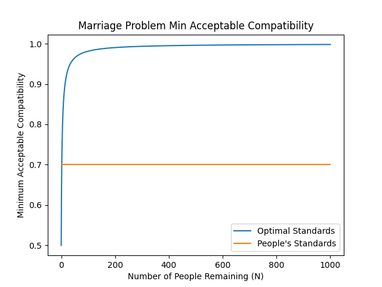

Made a little repo for the code and visualizations for what I do in my May blog post about a variation of the Marriage Problem, inspired by Caltech's BEM 114: Hedge Funds taught by Prof Andrew Sinclair

